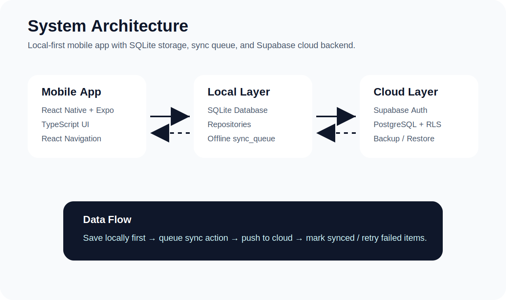
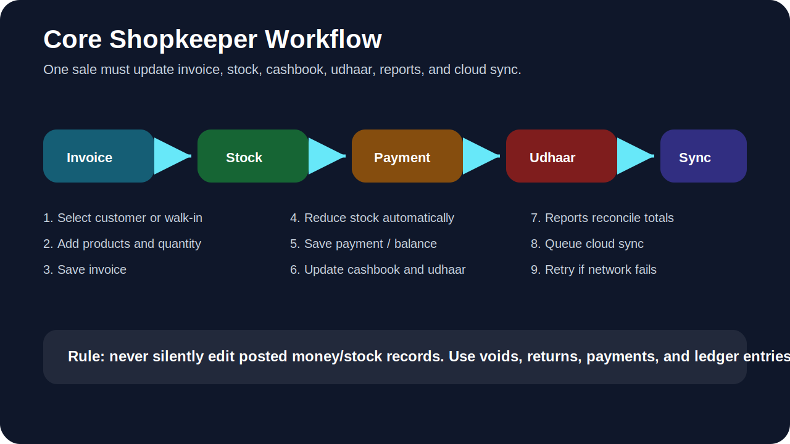

# Dukan App — Mobile Invoicing, Inventory & Cashflow

<p align="center">
  
</p>

<p align="center">
  
  
  
  
</p>

## Overview

**Dukan App** is a mobile-first shop management system for small businesses that need invoicing, product stock, customer udhaar/receivables, cashbook control, daily close, cloud backup, restore, and invoice sharing.

This project is built for the real small-shop workflow: create sale, reduce stock, record paid/unpaid amount, update customer balance, update cashbook, reconcile reports, and sync safely to the cloud.

> This is not just an invoice generator. The core idea is operational correctness: stock, money, udhaar, returns, reports, and cloud sync must stay consistent.

---

## Project Preview

<p align="center">
  
  
</p>

<p align="center">
  
  
</p>
<p align="center">
  
  
</p>

<p align="center">
  
  
</p>

<p align="center">
  
  
</p>

<p align="center">
  
  
</p>

<p align="center">
  
  
</p>

<p align="center">
  
  
</p>

<p align="center">
  
  
</p>

<p align="center">
  
    
</p>

<p align="center">
  
  
</p>

<p align="center">
  
  
</p>

<p align="center">
  
</p>
> These screenshots are pulled from the repository's `ss` folder for quick previewing in the README.

---

## Key Features

### Authentication & Business Setup

- Supabase email/password authentication
- Business profile setup
- First store setup
- User session restore
- Real logout
- Store/business status inside Settings

### Product & Inventory Management

- Add, edit, list, and delete products
- SKU, unit, cost price, selling price, stock quantity
- Low-stock alert support
- Stock reduction after invoice creation
- Stock restoration after invoice return/refund
- Product sync to Supabase

### Customer & Udhaar Management

- Add, edit, list, and delete customers
- Opening balance and credit limit
- Current balance tracking
- Customer ledger / udhaar screen
- Receive customer payment
- Automatic customer balance update from invoices and payments
- Balance repair from invoice balances

### Invoice System

- Walk-in or customer-based invoices
- Multiple products per invoice
- Paid, partial, and unpaid invoice handling
- Invoice item rows
- Stock movement after sale
- Customer balance update for unpaid/partial invoices
- Cashbook entry for paid amount
- Invoice detail screen
- Void/cancel invoice support
- Return/refund invoice support

### Cashbook & Daily Close

- Cash in / cash out tracking
- Expenses
- Customer payment cash-in
- Invoice payment cash-in
- Expected cash calculation
- Actual cash counted
- Daily close with difference/variance

### Reports

- Today, yesterday, this month, and all-time filters
- Sales summary
- Paid amount
- Cash in / cash out
- Expected cash
- Total udhaar
- Stock value
- Low-stock count
- Recent invoices
- Reconciliation checks

### Cloud Backup, Restore & Sync

- Supabase PostgreSQL cloud tables
- Row Level Security policies
- Local-first data save
- `sync_queue` pending/synced/failed status
- Manual retry pending sync
- Auto sync on app start/focus
- Pull products/customers from cloud
- Pull sales data from cloud
- Full sales restore foundation
- Danger Zone: clear local data and delete cloud business data safely

### Invoice Print / Share

- HTML invoice preview on web
- Web print / save as PDF
- Mobile PDF generation using Expo Print
- Native share sheet using Expo Sharing
- Business/store info on invoice

---

## Tech Stack

| Layer | Technology |
|---|---|
| Frontend | React Native + Expo |
| Language | TypeScript |
| Local Database | SQLite / localStorage fallback for web testing |
| Cloud Database | Supabase PostgreSQL |
| Auth | Supabase Auth |
| State Management | Zustand |
| Navigation | React Navigation |
| Sync | Custom `sync_queue` foundation |
| Invoice Share | Expo Print + Expo Sharing |
| Build | Expo / EAS Build |

---

## Architecture

<p align="center">
  
</p>

### Local-first principle

The app saves operational data locally first. Then it adds a sync item to the queue. If the internet is available, the queue is pushed to Supabase. If it fails, the item stays pending/failed and can be retried.

```text
Save locally
→ Add action to sync_queue
→ Push to Supabase
→ Mark synced
→ Keep failed items for retry
```

---

## Core Workflow

<p align="center">
  
</p>

```text
Open Dashboard
→ Create invoice
→ Select customer or walk-in
→ Add products
→ Save invoice
→ Stock decreases
→ Payment saved
→ Cashbook updates
→ Udhaar updates if unpaid/partial
→ Reports reconcile
→ Cloud sync runs
```

---

## Folder Structure

```text
src/
  app/            App startup logic, providers, initialization
  assets/         Images, icons, fonts
  components/     Reusable UI components
  constants/      Colors, spacing, app config, currency
  database/       SQLite setup, tables, repositories, local CRUD
  features/       Main feature modules
  hooks/          Custom React hooks
  navigation/     Stack/navigation configuration
  screens/        Auth and module screens
  services/       Supabase, sync, restore, print/share services
  store/          Zustand stores
  types/          TypeScript interfaces/types
  utils/          Helpers like currency/date/id formatters
```

---

## Main Screens

| Screen | Purpose |
|---|---|
| Login | User authentication |
| Signup | Account creation |
| Business Setup | Create business and first store |
| Dashboard | Main module entry point |
| Products | Product CRUD and stock |
| Customers | Customer CRUD and balances |
| Invoices | Create/list invoices |
| Invoice Detail | View, print/share, void, return invoice |
| Udhaar | Customer receivables and payment collection |
| Expenses | Cashbook, expenses, daily close |
| Reports | Business summary and reconciliation |
| Settings | Cloud status, sync, restore, danger zone |

---

## Database Tables

### Local / Cloud Core

```text
profiles
businesses
business_members
stores
products
customers
invoices
invoice_items
payments
cashbook_entries
daily_closes
invoice_returns
sync_queue
```

### Important data rule

Posted business actions should not be silently edited like a spreadsheet. The app uses safer correction flows:

- Wrong invoice → void invoice
- Product returned → return/refund invoice
- Customer pays later → receive payment
- Balance drift → repair from invoice balances
- Cloud failure → retry sync queue

---

## Environment Variables

Create a `.env` file in the project root:

```env
EXPO_PUBLIC_SUPABASE_URL=your_supabase_project_url_here
EXPO_PUBLIC_SUPABASE_ANON_KEY=your_supabase_anon_key_here
```

Do **not** put the Supabase `service_role` key in the mobile app. That key is server-only.

---

## Installation

```bash
npm install
```

If Expo packages are missing, install them with:

```bash
npx expo install @react-native-async-storage/async-storage
npm install @supabase/supabase-js react-native-url-polyfill zustand
npx expo install expo-print expo-sharing
```

---

## Run the Project

### Start Expo

```bash
npx expo start -c
```

### Run on web

```bash
npx expo start -c --web
```

### TypeScript check

```bash
npx tsc --noEmit
```

---

## Build APK

For direct Android installation, use APK build profile.

### Install and login to EAS

```bash
npm install -g eas-cli
eas login
eas whoami
```

### Configure EAS

```bash
eas build:configure
```

### `eas.json`

```json
{
  "build": {
    "preview": {
      "android": {
        "buildType": "apk"
      }
    },
    "production": {}
  }
}
```

### Build APK

```bash
eas build -p android --profile preview
```

---

## Testing Checklist

Before final submission/demo, test these flows:

- [ ] Signup/login works
- [ ] Business setup creates business and store
- [ ] Product add/edit/delete works
- [ ] Customer add/edit/delete works
- [ ] Product/customer sync appears in Supabase
- [ ] Create paid invoice
- [ ] Create partial invoice
- [ ] Create unpaid invoice
- [ ] Stock decreases after invoice
- [ ] Customer udhaar increases after unpaid/partial invoice
- [ ] Receive customer payment decreases balance
- [ ] Cashbook updates correctly
- [ ] Expense decreases expected cash
- [ ] Daily close saves actual cash and difference
- [ ] Reports show correct totals
- [ ] Reconciliation difference is `Rs 0`
- [ ] Invoice print/share works
- [ ] Void invoice reverses stock/balance/cash impact
- [ ] Return/refund restores stock and reduces balance/refunds cash
- [ ] Cloud backup works
- [ ] Clear local data works
- [ ] Pull from cloud restores products/customers/sales data
- [ ] Offline create → online retry sync works
- [ ] APK installs and works on Android phone

---

## Current Project Status

| Module | Status |
|---|---|
| Auth | Done |
| Business/store setup | Done |
| Products/customers | Done |
| Local database foundation | Done |
| Invoice creation | Done |
| Multiple invoice items | Done |
| Udhaar/payment | Done |
| Expenses/cashbook | Done |
| Daily close | Done |
| Supabase setup | Done |
| Product/customer sync | Done |
| Product/customer restore | Done |
| Sales cloud sync foundation | Done |
| Sales restore foundation | Done |
| Reports | Done |
| Invoice print/share | Done |
| Void invoice | Done |
| Return/refund | In progress / verify cloud restore carefully |
| APK build | Ready to build |

---

## Future Improvements

- Barcode scanning
- Thermal printer support
- Supplier bills and payables
- Purchase orders
- Multi-store stock transfer
- Role-based permissions UI
- Payment links
- WhatsApp/SMS reminders
- CSV/Excel import/export
- Advanced analytics
- Conflict resolution UI for multi-device offline edits
- Edge Function for real account deletion

---

## Final Year Project Angle

This project can be presented as a practical business solution for small shops that still depend on paper registers, WhatsApp messages, and Excel sheets. The strongest academic points are:

1. Offline-first mobile architecture
2. Local SQLite plus Supabase cloud backup
3. Sync queue design
4. Relational data model
5. Business process automation
6. Inventory and cashflow correctness
7. Reports and reconciliation
8. PDF invoice sharing
9. Real Android APK deployment

---

## Author

**Arham**  
Student & CTO  
Final Year Project — Mobile Application Development

---

## License

This project is for academic/final-year-project use. Add your preferred license before publishing publicly.
